# Decoding the GPRC5A Paradox in Pancreatic Ductal Adenocarcinoma

**Mark Barsoum Markarian** · Faculty of Medicine, American University of Beirut · *manuscript in preparation*

> **The paradox:** A machine learning biomarker screen found that GPRC5A, a known oncogene in pancreatic cancer, was *lower* in patients who died. That is the opposite of what the biology predicts. This repository is the full investigation into why.

---

## The Finding

Prior work ([Markarian 2025, bioRxiv](https://doi.org/10.1101/2025.11.14.688421)) identified GPRC5A as prognostically relevant in PDAC but flagged a contradiction: reduced expression in deceased patients. Three explanations were possible, molecular subtype mixing, gemcitabine-induced transcriptional confounding, or post-transcriptional regulation. This five-aim pipeline tests all three.

**Short answer: it is mostly Simpson's Paradox.**

GPRC5A behaves differently depending on which molecular subtype of PDAC a tumor belongs to. When you pool both subtypes and look at bulk expression, the signal flips, not because the biology changed, but because the aggregate obscures two opposing subtype-specific associations.

---

## Key Results

### Aim 1: Subtype stratification explains the paradox

Classical subtype (n=100): high GPRC5A → significantly **worse** survival (HR=1.53, p=0.0017)  
Basal-like subtype (n=77): high GPRC5A → **better** relative survival (log-rank p=0.022)

Pooling them without stratification creates an artifactual inverse signal... a textbook Simpson's Paradox.

|  | 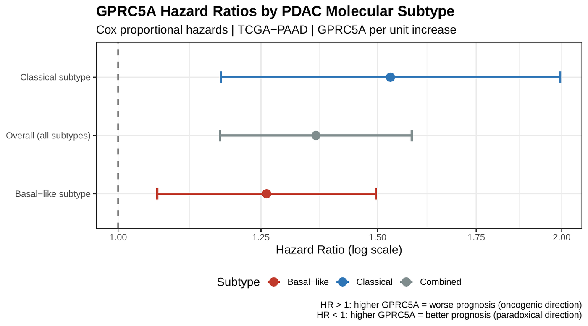 |
|:---:|:---:|
| *Kaplan–Meier by subtype — opposing directionality* | *Cox HRs across models including interaction term (p=0.272, n.s.)* |

| 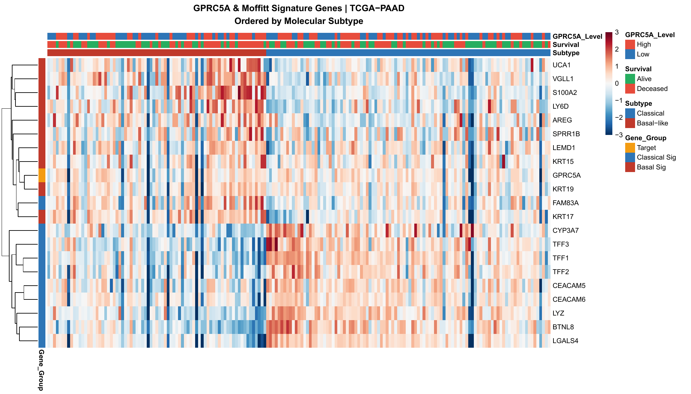 | 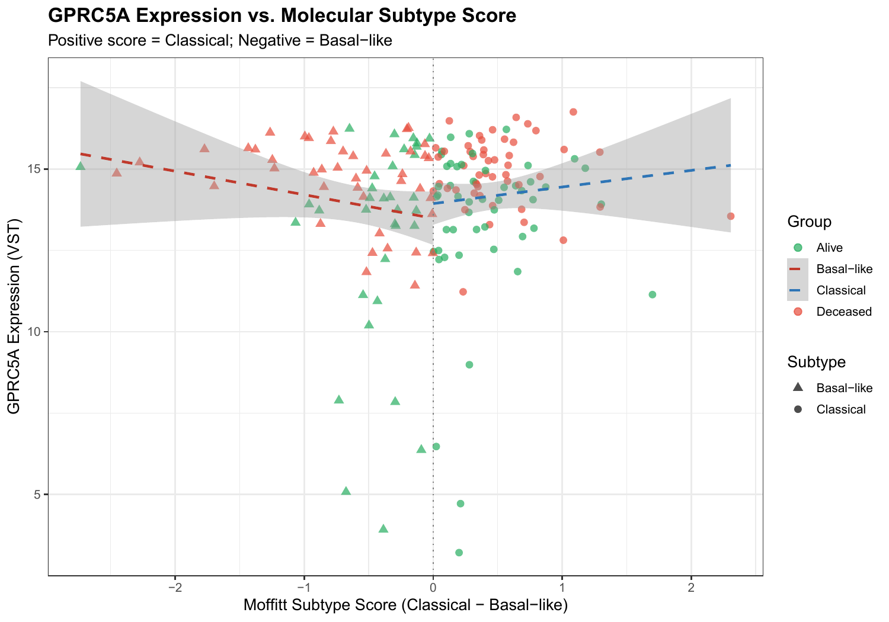 |
|:---:|:---:|
| *GPRC5A co-clusters with the classical gene signature* | *GPRC5A expression vs. Moffitt composite subtype score* |

| 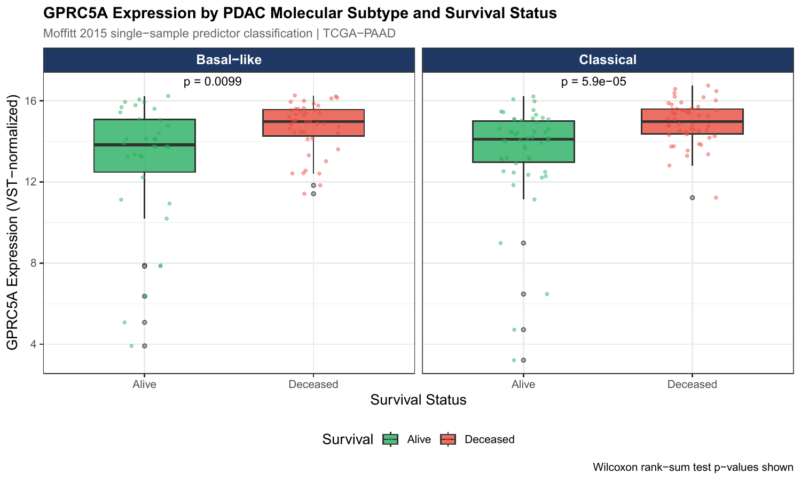 |
|:---:|
| *Within-subtype expression: higher GPRC5A consistently associates with worse survival in both subtypes (Classical p=5.9×10⁻⁵, Basal-like p=0.0099)* |

---

### Aim 2: Gemcitabine is a secondary confound, not the primary cause

In gemcitabine-treated patients, the GPRC5A HR attenuates to non-significance (HR=1.22, p=0.221). In the fully adjusted multivariable model it remains significant (HR=1.44, p=3.89×10⁻⁶). Gemcitabine confounds the signal, it does not create it. Treatment-naive comparison is not feasible (n=1).

| 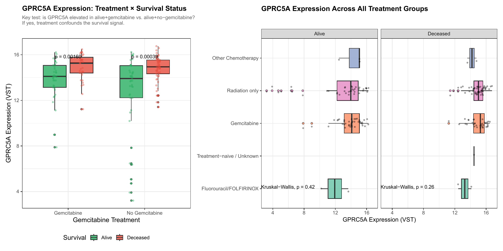 | 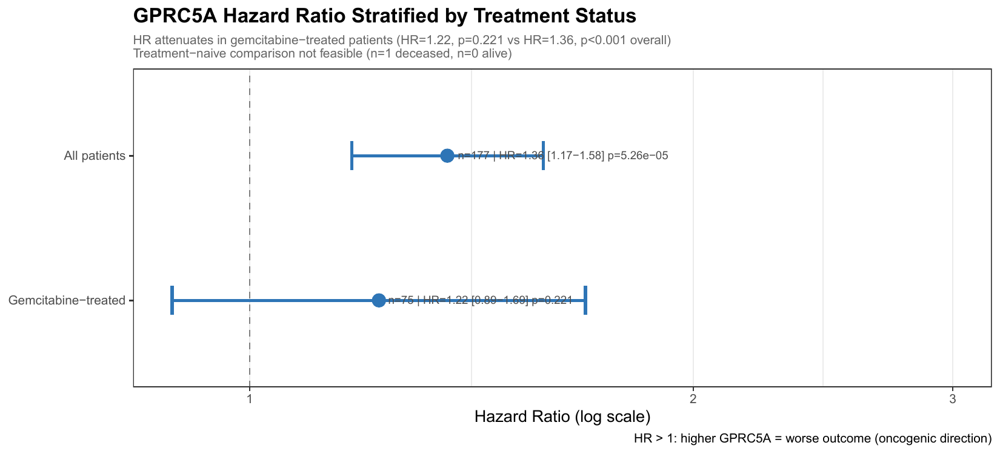 |
|:---:|:---:|
| *GPRC5A expression by treatment group and vital status* | *HR attenuation in gemcitabine-treated patients* |

| 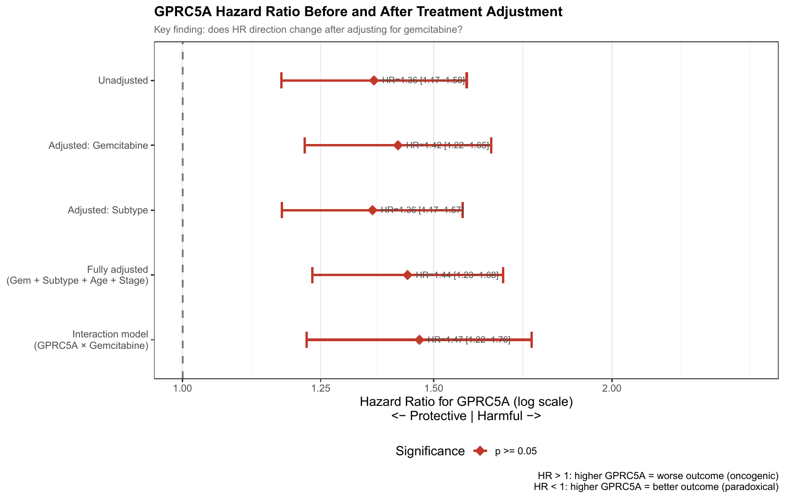 |  |
|:---:|:---:|
| *GPRC5A HR stable across five multivariable adjustment models* | *KM curves stratified by treatment group* |

---

### Aim 3: Post-transcriptional regulation is not the driver

GPRC5A RNA–protein Spearman r = 0.571 across 140 matched CPTAC-PAAD samples. That puts it at the **84.6th genome-wide percentile**, among the better-translated genes in PDAC, not an outlier subject to repression.

| 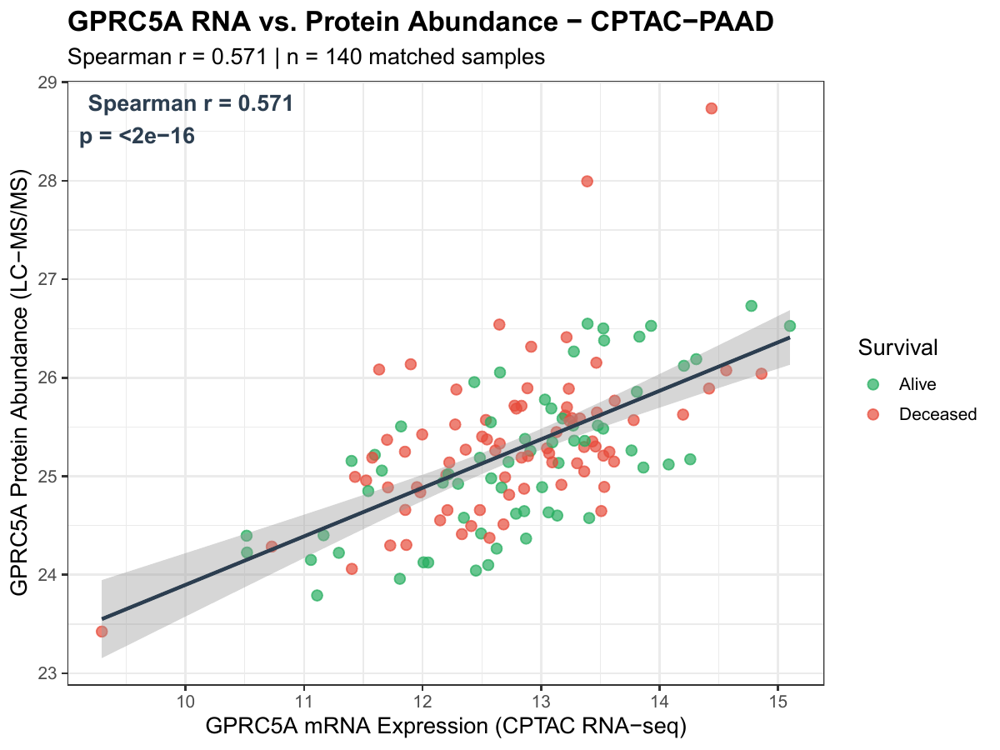 | 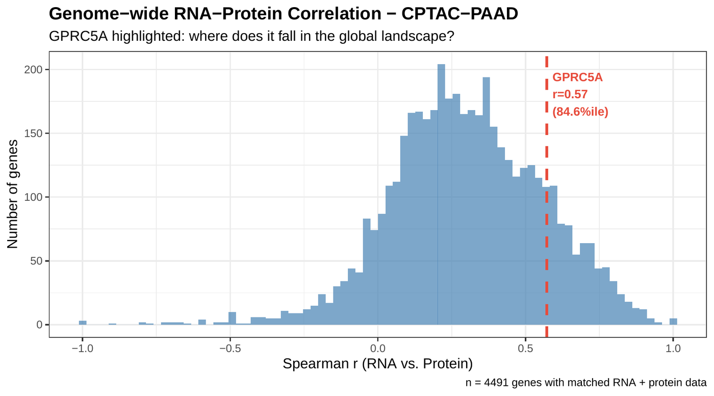 |
|:---:|:---:|
| *GPRC5A RNA vs. protein across 140 matched CPTAC-PAAD samples (r=0.571)* | *GPRC5A at 84.6th percentile of 4,491 genome-wide gene pairs* |

---

### Aim 4: Zero somatic mutations in GPRC5A across TCGA-PAAD

No recurrent coding mutations across 177 samples. GPRC5A dysregulation is **regulatory, not structural**, pointing future work toward epigenomics and transcription factor binding.

| 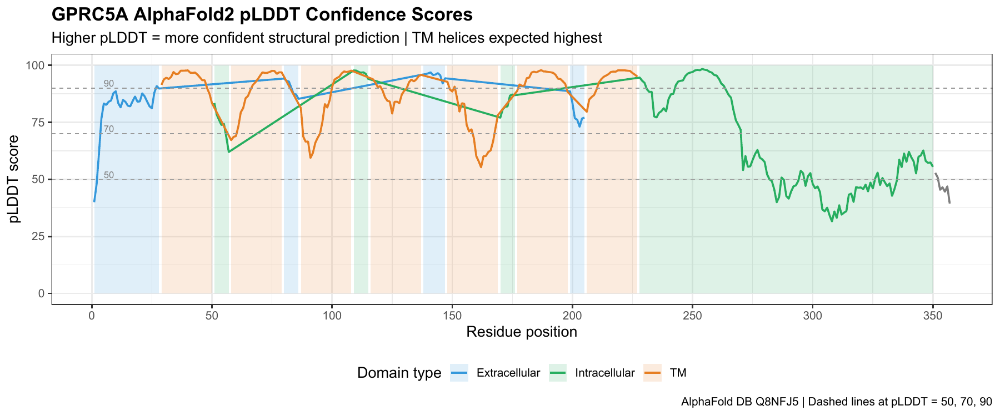 | 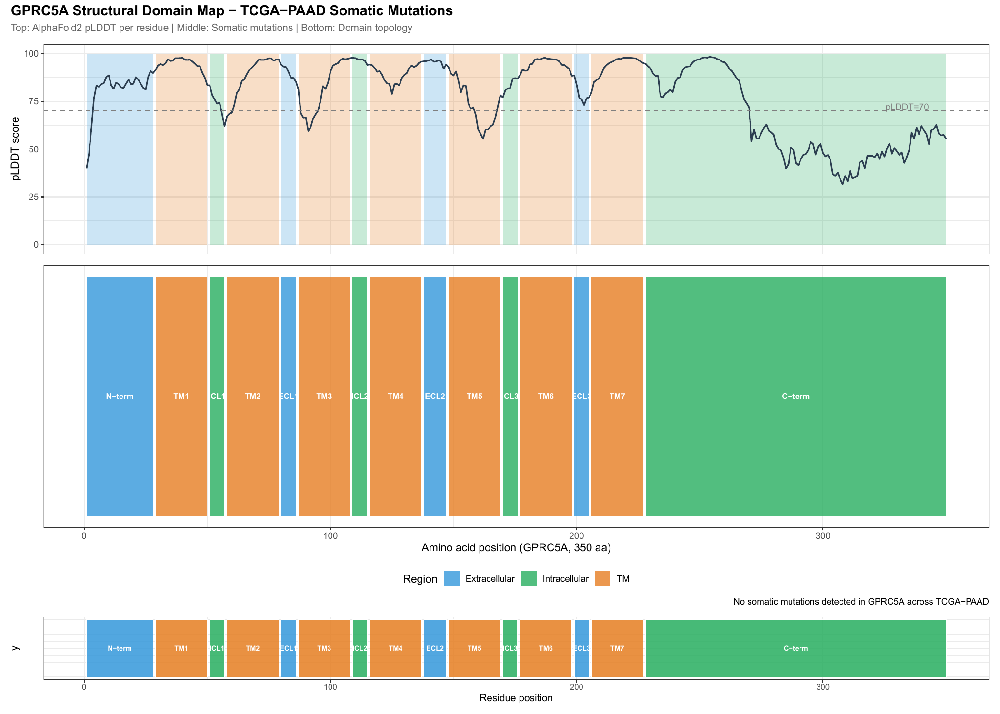 |
|:---:|:---:|
| *AlphaFold2 per-residue confidence with domain annotations* | *Empty somatic mutation track, null result is the finding* |

---

### Aim 5: ML classifier predicts GPRC5A functional role state

A leakage-free Random Forest trained on subtype scores and co-expression features predicts whether GPRC5A is acting oncogenically or suppressively in a given tumor.

- Held-out test AUC: **0.833** · LOOCV AUC: 0.758  
- GPRC5A expression ranks **23rd** in feature importance, the broader subtype context matters more than the gene itself  
- *Caveat: labels incorporate vital status; AUC reflects proof-of-concept subtype-context encoding, not independent prognostic prediction*

| 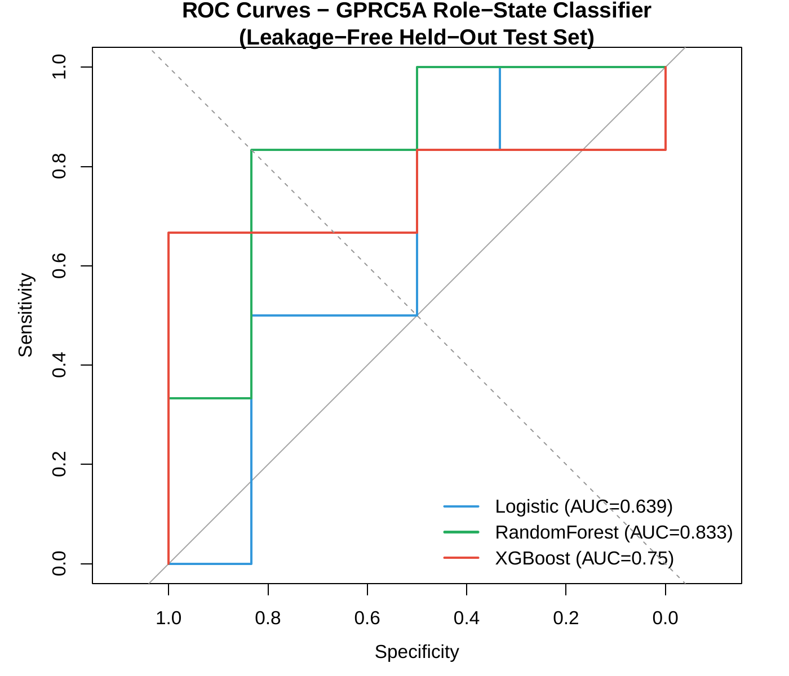 | 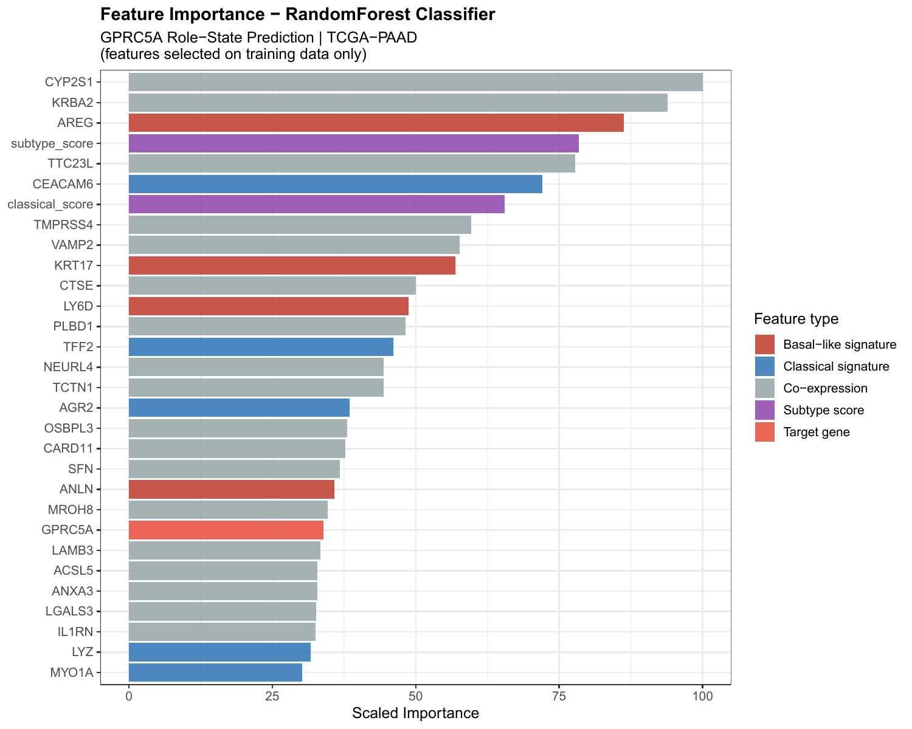 |
|:---:|:---:|
| *Held-out test ROC, RF AUC=0.833* | *Classical co-expression features dominate (GPRC5A ranks 23rd)* |

| 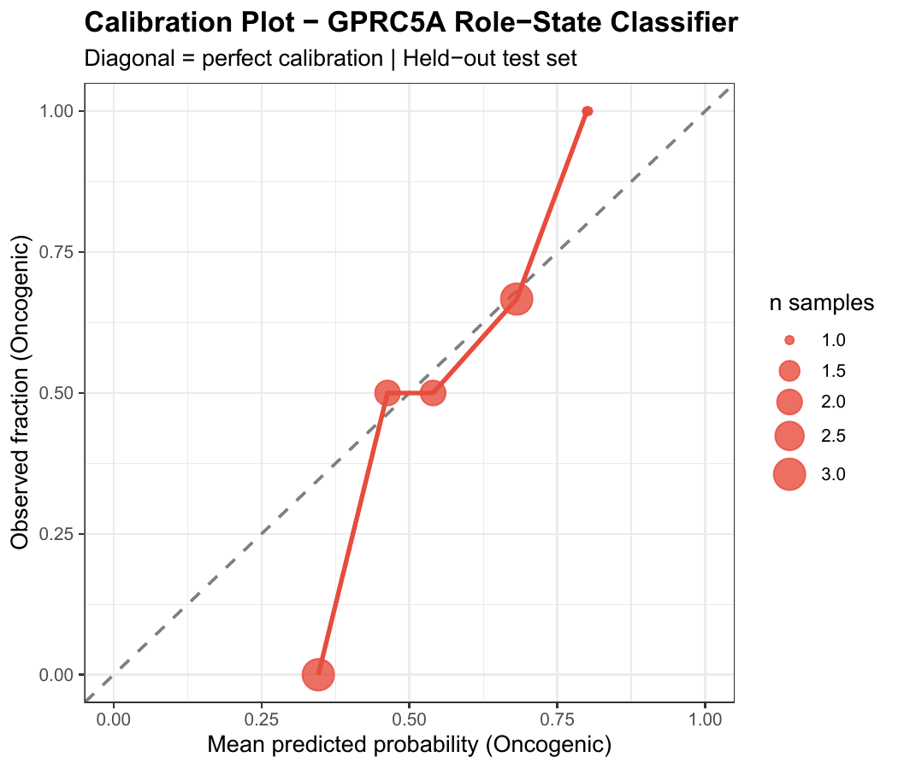 |  |
|:---:|:---:|
| *Classifier calibration on held-out test set* | *KM by predicted role state, directional trend, p=0.18 (n=12, underpowered)* |

---

## Repository Structure

```
gprc5a-paradox-pdac/
├── R/
│   ├── utils_clinical.R                  # TCGAbiolinks version-agnostic clinical utilities
│   ├── aim1_subtype_stratification.R     # Moffitt classifier + subtype-stratified Cox
│   ├── aim2.R                            # Gemcitabine deconfounding + multivariable Cox
│   ├── aim3.R                            # CPTAC RNA–protein correlation + genome-wide benchmarking
│   ├── aim4.R                            # AlphaFold2 domain mapping + somatic mutation extraction
│   ├── aim5.R                            # Leakage-free RF / XGBoost / logistic classifier
│   └── regen_figures.R                   # Regenerate fixed figures from pre-computed tables
├── results/
│   ├── figures/                          # PNG figures (embedded above) + PDFs
│   └── tables/                           # CSV result tables for all aims
└── data/                                 # Not tracked — see Data Access
```

## Reproducing the Analysis

### 1. Install dependencies

```r
install.packages(c("here", "dplyr", "ggplot2", "pheatmap", "survival",
                   "survminer", "viridis", "RColorBrewer", "sva",
                   "caret", "randomForest", "xgboost", "glmnet", "pROC"))

if (!requireNamespace("BiocManager")) install.packages("BiocManager")
BiocManager::install(c("TCGAbiolinks", "DESeq2"))
```

### 2. Run in order

```r
source("R/utils_clinical.R")               # must be sourced first
source("R/aim1_subtype_stratification.R")  # downloads TCGA-PAAD on first run
source("R/aim2.R")
source("R/aim3.R")                         # requires CPTAC data in data/cptac/
source("R/aim4.R")
source("R/aim5.R")
```

All scripts use `here::here()` for paths, run from the project root. Outputs write automatically to `results/figures/` and `results/tables/`.

### 3. Data access

| Dataset | Where |
|---|---|
| TCGA-PAAD (RNA-seq, clinical, mutations) | Auto-downloaded via `TCGAbiolinks` from GDC on first run |
| CPTAC-PAAD proteomics | [CPTAC Data Portal](https://cptac-data-portal.georgetown.edu) |
| AlphaFold2 GPRC5A structure (Q8NFJ5) | [AlphaFold DB](https://alphafold.ebi.ac.uk/entry/Q8NFJ5) |

---

## Citation

If you use this code, please cite the companion preprint:

> Markarian MB. Batch-harmonized machine learning framework for cross-cohort RNA biomarker discovery in pancreatic adenocarcinoma. *bioRxiv*. 2025. https://doi.org/10.1101/2025.11.14.688421

The GPRC5A paradox manuscript is in preparation.

---

## License

MIT — see [LICENSE](LICENSE)

## Keywords

`GPRC5A` · `PDAC` · `pancreatic cancer` · `Simpson paradox` · `Moffitt subtypes` · `gemcitabine` · `CPTAC` · `AlphaFold2` · `machine learning` · `oncogenic switching` · `R` · `bioinformatics`
