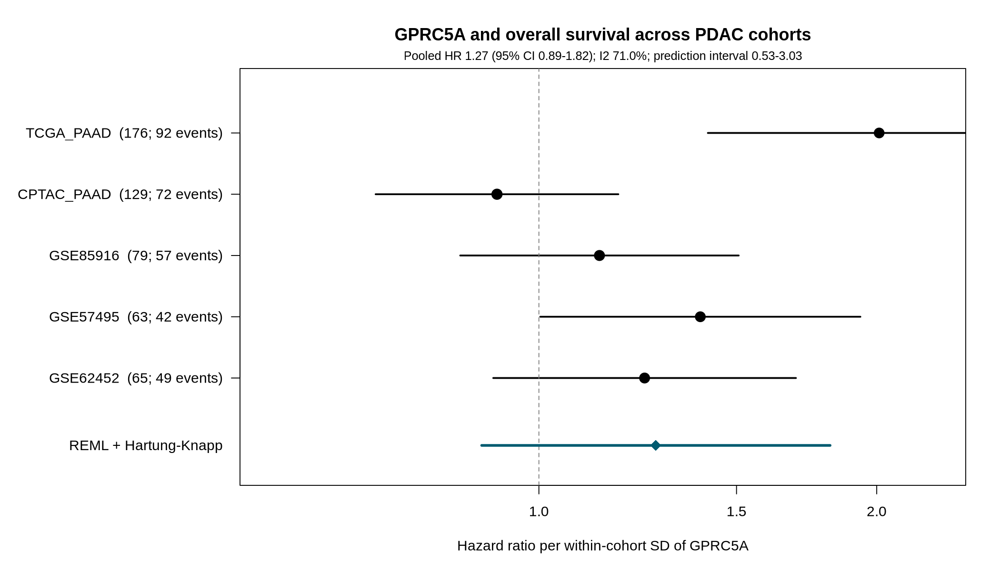
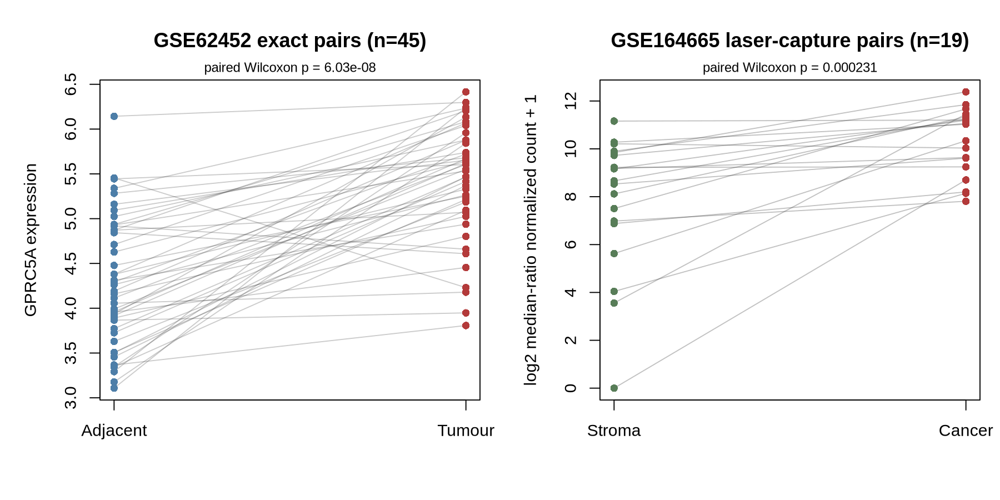
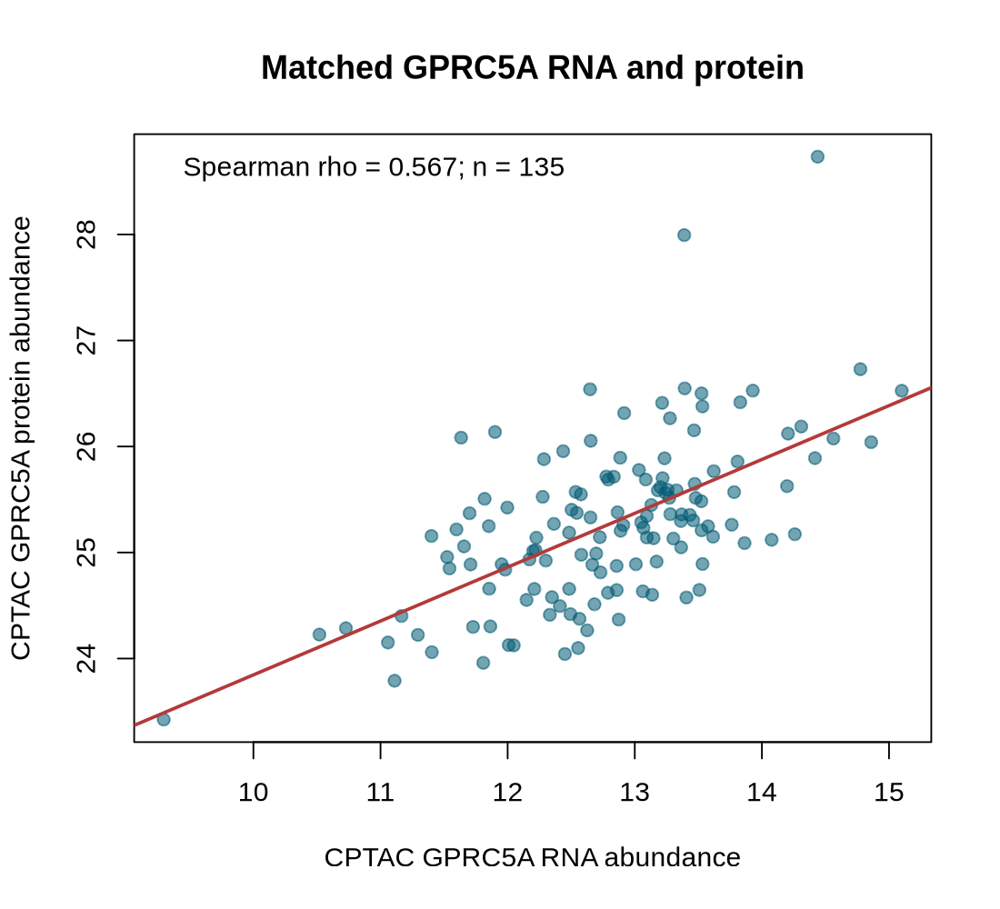

# GPRC5A in PDAC: target expression is robust, prognosis is not

**Mark Barsoum Markarian**

Version 2 analysis · September 2026

**Preprint status:** A corrected version 2 was submitted to Research Square on
12 September 2026 and is awaiting posting. The article identifier remains
`rs-9237732`; once posted, cite the version-specific DOI ending in `/v2`.

> **Correction:** the repository previously claimed that GPRC5A had opposite
> survival associations in classical and basal-like PDAC and called this a
> Simpson's paradox. The saved results do not support that claim. Both subtype
> estimates point toward worse survival at higher expression, and the formal
> interaction is not significant. See [CORRECTION_NOTICE.md](CORRECTION_NOTICE.md).

This repository now asks a narrower and more useful question: **can strong,
cancer-cell-enriched expression make GPRC5A a plausible PDAC target even when
its value as a prognostic biomarker does not transport reliably across cohorts?**

## Version 2 result

Five independent primary-tumour cohorts were analysed on their native platforms.
GPRC5A was standardized *within each cohort*; platforms were never pooled or
batch-corrected together. Overall survival was modelled with censoring-aware Cox
regression and combined using a random-effects model with Hartung-Knapp inference.

| Cohort | Platform | Patients / deaths | HR per SD (95% CI) | P |
|---|---|---:|---:|---:|
| TCGA-PAAD | RNA-seq | 145 / 84 | 1.27 (0.99–1.63) | 0.060 |
| CPTAC-PAAD | RNA-seq | 129 / 72 | 0.92 (0.72–1.18) | 0.498 |
| GSE85916 | Affymetrix U219 | 79 / 57 | 1.13 (0.85–1.51) | 0.394 |
| GSE57495 | Rosetta/Merck microarray | 63 / 42 | 1.39 (1.00–1.93) | 0.048 |
| GSE62452 | Affymetrix Gene 1.0 ST | 65 / 49 | 1.24 (0.91–1.69) | 0.171 |

**Pooled:** HR 1.16, 95% CI 0.94–1.43, P=0.118; I²=28.2%; 95% prediction
interval 0.80–1.69 (481 patients, 304 deaths).



The pooled association is not statistically significant, heterogeneity is
moderate, and leave-one-cohort-out estimates remain inconclusive. This does
**not** validate GPRC5A as a transportable stand-alone prognostic biomarker.
GSE62452 also fails the proportional-hazards check (P=0.023); its reported Cox HR
is therefore an average over time. A clearly labelled post-hoc diagnostic finds
HR 0.91 before 12 months and HR 1.83 afterward (time interaction P=0.019).

## What does replicate

- **Tumour versus adjacent tissue:** in 45 exact GSE62452 patient pairs, tumour
  expression was 2.20-fold higher on average (paired Wilcoxon P=6.03×10⁻⁸).
- **Cancer versus stroma:** in 19 treatment-naive laser-capture pairs from
  GSE164665, cancer-cell expression was 5.67-fold higher on average (paired
  Wilcoxon P=2.31×10⁻⁴).
- **RNA to protein:** in 135 matched CPTAC PDAC tumours, RNA and protein were
  moderately concordant (Spearman rho=0.567, P=7.40×10⁻¹³).
- **No subtype reversal:** within TCGA, both reconstructed Moffitt groups had
  adverse point estimates (basal-like HR 1.12; classical HR 1.41), while the
  age- and stage-adjusted GPRC5A-by-subtype interaction was not significant
  (P=0.146).





These observations support **cancer-cell enrichment and measurable protein
translation**, not therapeutic efficacy. Cell-surface accessibility, normal-
tissue safety, and treatment response still require direct experimental work.

## Interpretation

The defensible “paradox” is translational rather than Simpsonian:

> GPRC5A has a reproducible target-expression phenotype, but its bulk-tumour
> survival association is cohort-dependent and insufficiently transportable for
> stand-alone prognosis.

This distinction matters because target candidacy and prognostic performance are
different questions. Recent independent spatial work likewise reports broad
GPRC5A expression across malignant PDAC regions, while cautioning that normal-
tissue expression and protein-level validation determine the therapeutic window
([Guo et al., 2025](https://doi.org/10.1016/j.celrep.2025.116191)).
Earlier functional studies already support oncogenic and drug-resistance roles;
version 2 does not claim to rediscover them
([Zhou et al., 2016](https://pmc.ncbi.nlm.nih.gov/articles/PMC4973341/)).

## Reproduce version 2

Requirements: R 4.x and the recommended `survival` package. No Bioconductor
installation is needed for the main run.

```bash
Rscript R/v2/run_v2.R
```

The script downloads public source files, checksums them, applies explicit
specimen and survival eligibility rules, and rebuilds every version 2 table and
figure under `results/v2/`. See:

- [Analysis protocol](docs/V2_PROTOCOL.md)
- [Manuscript-ready results and limitations](docs/V2_RESULTS.md)
- [Pipeline documentation](R/v2/README.md)
- [Input manifest](results/v2/tables/input_manifest.csv)
- [Detailed sample flow](results/v2/tables/sample_flow_details.csv)
- [All cohort estimates](results/v2/tables/cohort_cox_results.csv)
- [Clinical-adjustment sensitivity](results/v2/tables/cohort_adjusted_sensitivity.csv)
- [Leave-one-cohort-out analysis](results/v2/tables/leave_one_cohort_out.csv)

## Repository layout

```text
R/v2/run_v2.R          primary reproducible analysis
config/                explicit microarray probe mapping
docs/                  protocol and manuscript-ready interpretation
results/v2/tables/     version 2 numerical outputs
results/v2/figures/    version 2 figures
R/aim*.R               superseded legacy scripts, retained for auditability
results/tables/        superseded legacy outputs
results/figures/       superseded legacy figures
```

The legacy machine-learning “role-state” classifier is withdrawn: its outcome
was partly constructed from vital status, subtype, and GPRC5A while related
variables were reused as predictors. Its AUC cannot establish independent
prediction. Treatment-stratified legacy analyses are also not causal evidence
because treatment timing and a viable untreated comparator were unavailable.

## Scope and status

This is a computational reanalysis of public retrospective cohorts. It is not a
clinical test and does not establish treatment benefit. The corrected manuscript
has been submitted to Research Square as version 2 and is awaiting posting. The
earlier batch-harmonization preprint nominated GPRC5A, but the present survival
claims should be cited only from the corrected version once it is public.

## License

MIT; see [LICENSE](LICENSE).
